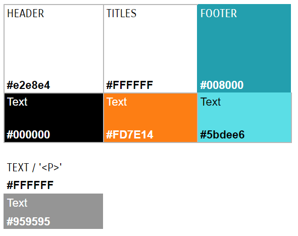

# P4 DIW: LAYOUT WITH BOOTSTRAP

## Desplegament a Netlify
brave-hypatia-0cc3ec.netlify.app/

## Components emprats
Els components que he emprat són:
- Navbar per es header.
- Buttons per es botó des hamburger.
- Collapse al botó des hamburger, per mostrar els diferents links de les pàgines.
- Cards.

## Utilitats emprades
He fet servir margins a les fotografies de les cartes i flexbox options per cada pàgina.
També he creat noves classes al fitxer scss, on he fet servir el flexbox, margins i 
alignments com el justify.  

## Què heu customizat en el fitxer custom.scss?
Primer de tot, comentar que he fet servir l'opció A per lo comentat a classe. 
Seguidament, he sobreescrit els següents colors: $cyan, $gray-100, $gray-500.  

## Colors de paleta de colors
La paleta de colors que fa servir la pàgina és la següent:

He de recalcar que el header i el footer no són exactament colors, sinó imatges ja que la 
pàgina que m'ha tocat tenia aquestes imatges. Però encara i així, aquests són els colors que 
destaquen a la pàgina web.

## Millores
Una de les millores que he fet és fer active totes les pàgines (a més del home i el blog).
Per altra banda, he fet una millora a la pàgina home: 
en la resolució del mòvil sa veia amb el següent ordre: 
imatge - text - text - imatge - imatge - text

Personalment, no quedava molt bé per això, he creat unes classes dins breakpoints que podem 
veure-ho dins el fitxer custom.scss. 

L'anterior millora, també la he aplicada a la pàgina subdivisions ja que l'ordre dels items 
a la resolució de mòvil era el següent: 
text - imatge - text - imatge - text - imatge - text - imatge

Personalment, tenia més sentit que la imatge vagi abans que el text per donar-li una idea a 
l'usuari de que va i també és molt més clar.

Altres millores que he fet els a trobam a la pàgina blog. En resolució 'lg', és a dir, 
resolució d'ordinador, les cartes se veuen horitzontals. A partir de la resolució sm, és a dir,
(breakpoint-down(md)), faig les cartes verticals; les millor, fent un max-width i modificant
les dimensions de la imatge. D'aquesta manera sa veuen millor i no es veu un espai sobrant 
als laterals.

Per altra banda, he fet una millora a la pagination: en la resolució d'ordinador, es veuen
'First 1 - 10 Last', però a la resolució de mòvil les amag amb la classe: 'hide-mobile', on té la
propietat: 'display:none'.

